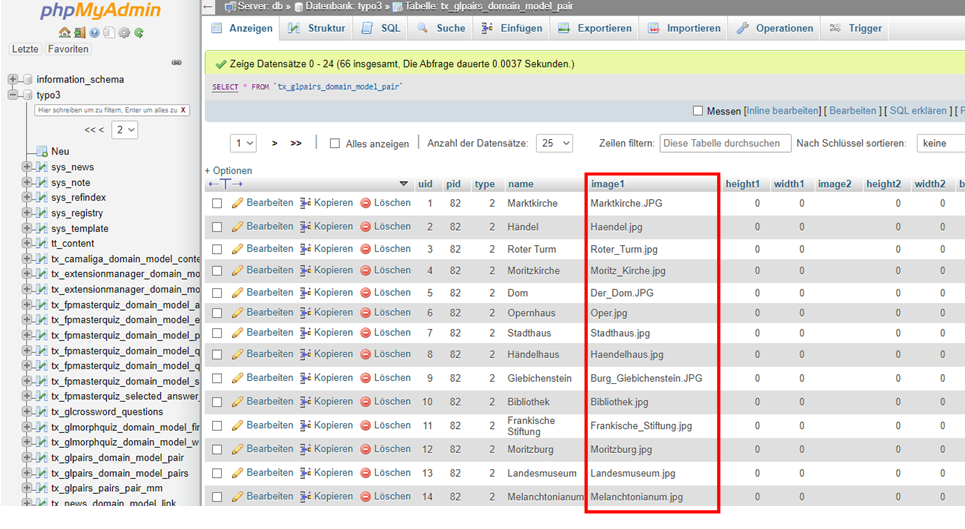
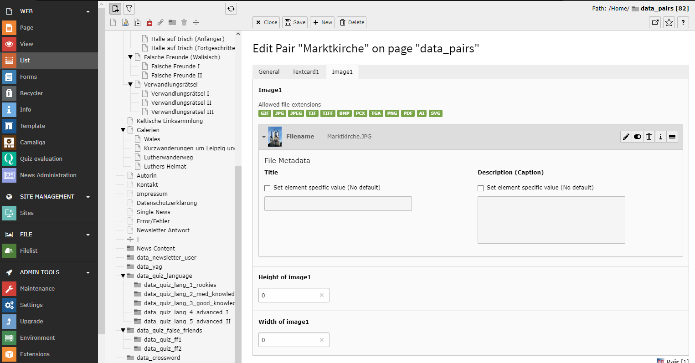

.. ==================================================
.. FOR YOUR INFORMATION
.. --------------------------------------------------
.. -*- coding: utf-8 -*- with BOM.

.. include:: ../../Includes.txt

.. _fal-migration:

FAL Migration for Version 2.2
-----------------------------

If you update from a version below 2.2 to a current version than you need to be aware, that since version 2.2 glpairs is using FAL for referencing to images. That means all your current games with images on the cards (not the back images of the cards) need to configure new after the update. If you go after the update in the list view and from there to a pair you will face an empty image. If you want to know which image you had in this card, you can look into the old fields (image1 or image2) of the table tx_glpairs_domain_model_pair with PhpMyAdmin or a similar tool.

The only thing you have to do is to create a new reference to the existing image on your server like in this screenshot.

