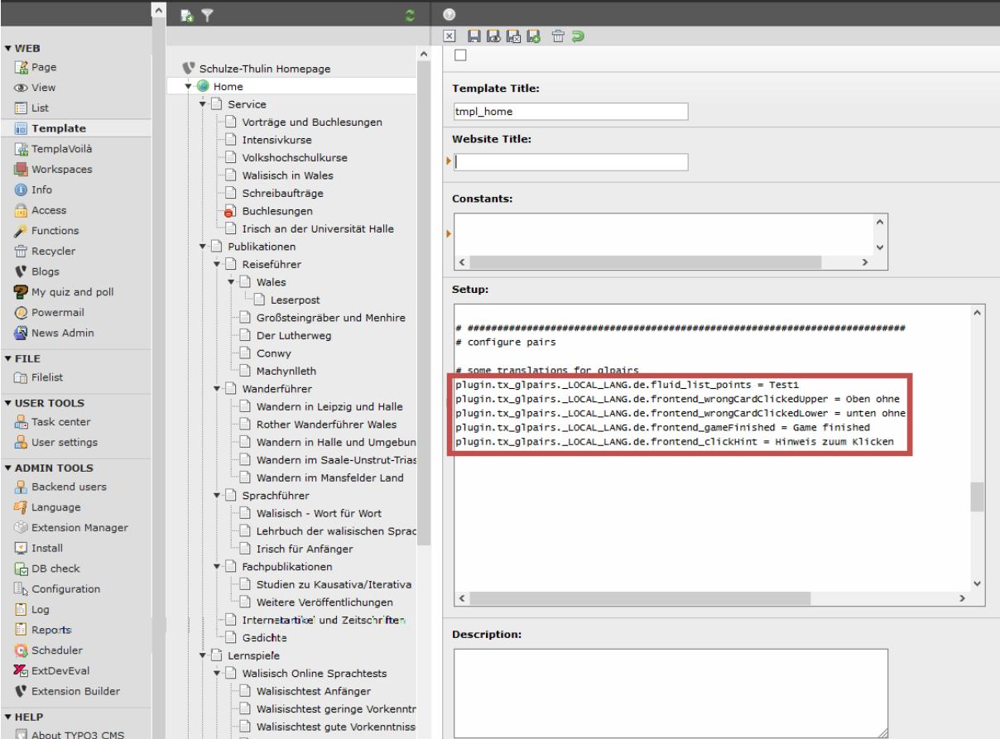

.. ==================================================
.. FOR YOUR INFORMATION
.. --------------------------------------------------
.. -*- coding: utf-8 -*- with BOM.

.. include:: ../../Includes.txt

.. _administration-language-setting:

Language setting
----------------

All language dependent settings are located in the folder *typo3conf\\ext\\glpairs\\Resources\\Private\\Language\\*

.. tip::
  Don't edit the xlf files in the Language folder directly. After every update of this extension,
  this files will be overwritten.

If you like to change the language setting  you have to do this with typoscript in your
template configuration. All available labels you can find in the file locallang.xlf. You cab change the language settings 
with the following statement.

::

	plugin.tx_glpairs._LOCAL_LANG.de.fluid_list_points = My Custom Points Label

