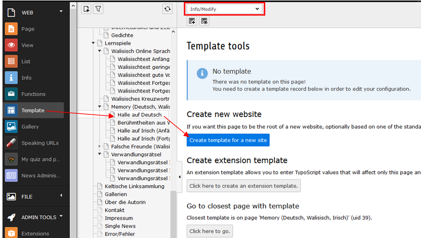
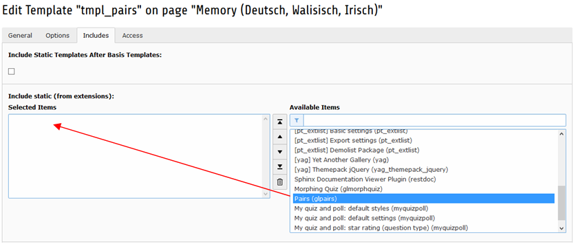
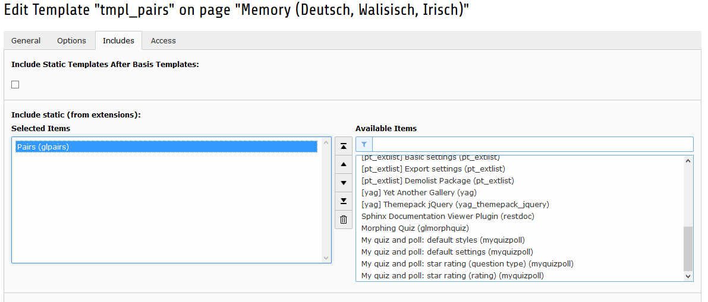
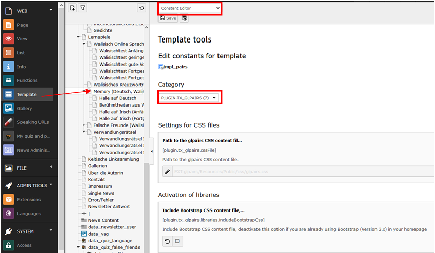

.. ==================================================
.. FOR YOUR INFORMATION
.. --------------------------------------------------
.. -*- coding: utf-8 -*- with BOM.

.. include:: ../Includes.txt

.. _configuration:

Configuration
=============

In the first step you need to create a template for the page with your pairs game.

In the next step you need to edit the template and include on the tab "Includes" the "Pairs (pairs)" static template.

Move the statice template to the left side for "Selected Items".

In the end you can choose the constants editor and adjust some constants in the static template. In the next chapter you
can see a description of this constants.

.. toctree::
    :maxdepth: 2
    :titlesonly:

    plugin.tx_glpairs/Index
