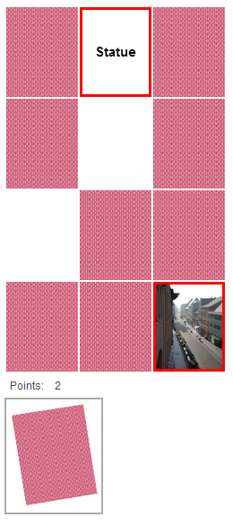
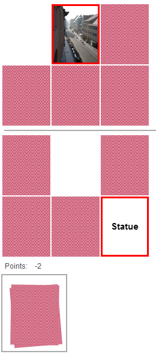
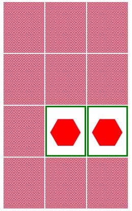
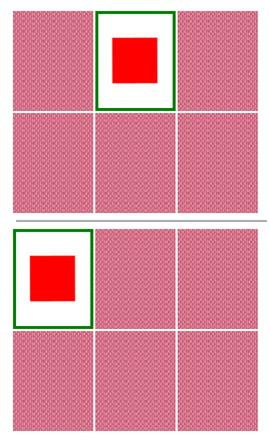
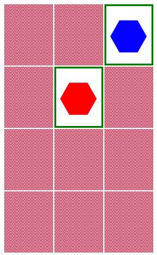
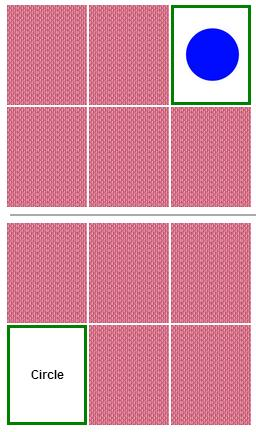
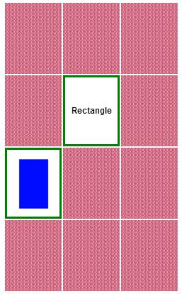
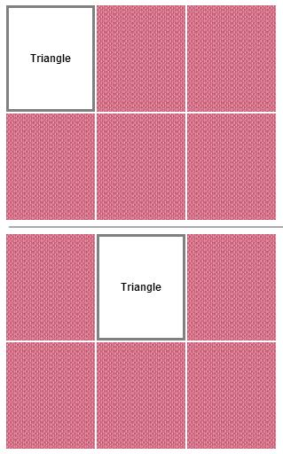
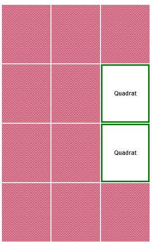

.. ==================================================
.. FOR YOUR INFORMATION
.. --------------------------------------------------
.. -*- coding: utf-8 -*- with BOM.

.. include:: ../Includes.txt

.. _introduction:

Introduction
============

**Attention! Since version 2.0.0 you need to include a static template. Please take sure to include
this template like in the chapter** :ref:`Configuration<configuration>` **described.**

This is a plugin to provide a pairs game. The extension is very flexible. You are able to adjust the
size of every single card or of the whole pairs game. So you can do with the fontsize if you are in
a text mode. The frontend is a interactive javascript user interface, which should be generally
self-explanatory.

You are able to configure a wide range of pairs games.

- The standard is a pairs game where one pair is always the same picture.
- You are also able to configure a pairs game, where one pair are two similar pictures. (i.e. two
cats or two dogs)
- The third possibility is to configure a pairs game, where one pair is a picture and a textcard. On
the textcard is a description of the picture (i.e. a picture of a cat and a text card with the
description “cat” or “Katze” if you like to learn german with it)
- The last posibility is to configure a pairs game with two text cards. Usually you should use two
different languages on both textcards. This is also a good possibility to learn foreign languages.
(i.e. a text card with the description “dog” and a text card with the description “Hund”)

A pairs game with the picture to text pairs type.

For all this type of games you are able to provide them in a split mode. In this mode is the fist
card of the pair always in the upper area and the second card in the lower area. For every turn you
need to choose one card of the upper and one card of the lower area.

The whole game supports on the frontend and on the backend different languages. Currently it is
configured with the english language as default and with german.

All language labels for the frontend are stored in the file
typo3conf\ext\glpairs\Resources\Private\Language\locallang.xml. This labels can be overruled with
typoscript like this.

.. code-block:: typoscript

    plugin.tx_glpairs._LOCAL_LANG.de.fluid_list_points = Punkte changed from typoscript

The *fluid_list_points* is one of the labels of the *locallang.xml* file.

Pairs game with the same pictures with split mode and without split mode.

|image-7| |image-10|

Pairs game with two similar pictures with split mode and without split mode.

|image-6| |image-3|

.. |image-3| image:: ../Images/image-3.jpg

Pairs game with picture to text card with split mode and without split mode.

|image-4| |image-5|

Pairs game only with text cards with split mode and without split mode.

|image-17| |image-15|

