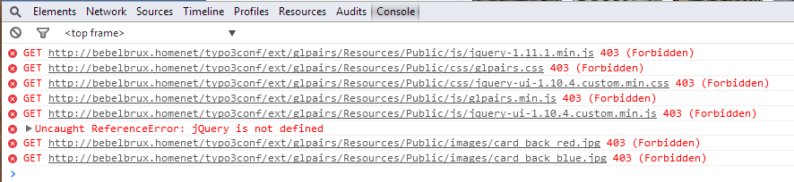
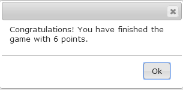
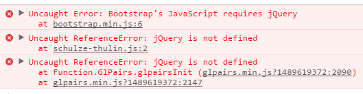
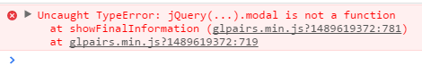
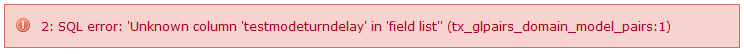

.. ==================================================
.. FOR YOUR INFORMATION
.. --------------------------------------------------
.. -*- coding: utf-8 -*- with BOM.

.. include:: ../Includes.txt

.. _troubleshooting:

Troubleshooting
===============

- **The pairs game is not responding on mouse clicks**

If the pairs game is displayed, but not reacting on your mouse clicks, then please have look into
your console of your browser. In chrome you can get the console with the shortcut Ctrl-Shift-j.
Sometimes you can see there the following Server Error 500.

You can also have a look into your apache error log, usually located in /var/log/apache2/error.log.
There is probably a error like that.

::

    PHP Fatal error: Call to a member function getm_arrExtIdMapping() on a non-object in /var/www/typo3conf/ext/glpairs/Classes/Controller/PairsController.php on line 582

In both cases you have trouble with the ajax session in the beginning of the game. Usually you can
solve it while you delete all the typo3 caches in the backend. If the error remains, then check if
you have set the correct UTF settings in the install tool for your database. For this settings see
the description in this document in the chapter :ref:`Installation<administration-installation>`.

- **The pairs game has a destroyed layout and shows the frontside of all cards**

If the layout of the pairs game is completely destroyed and all cards are showed with there
frontsides, then have also a look into the console of your browser (Ctrl-Shift-j). If you can see an
error message like that.

The you have no permission to access the public folder of this extension with all the css and
javascript files. Please grant the access in your apache configuration. How to setup the apache for
this configuration you can read in the chapter :ref:`Installation<administration-installation>` in this document.

- **No dialogs apears or game is not respondig on mouse clicks**

In the game no dialog boxes apears. For instance the final information or the dialog at the end of the game with the
congratulations for finishing the game.

If you go into the console log (Shortcut Ctrl-Shift-j) then you can see error messages that the
jQuery library not exist.

In this case you should check the HTML source code of your page. You have very likely linked the
jQuery library twice in your page or you have it not linked at all. This happens mostly because
of other extensions or if you have forgotten the static template. In this case you need to deactivate
the other extensions for this page. It is very important, that after the link to the file
“jquery-3.1.1.js” no other jQuery library is linked in your HTML page. See the chapter
:ref:`Configuration<configuration>` and :ref:`plugin.tx_glpairs<ts-plugin-tx-glpairs>` how to activate
and deactivate the javascript libraries.

If you see an error like this in the Browser console.

You need to activate the Bootstrap library. See also in the both chapters above for this settings.

- **SQL Error in the backend**

Especially after an update of the extension, a SQL error can happen if you try to edit a pairs game.

|image-37|

Usually it is an error about an unknown column. In this case has the update routine of
typo3 not properly updated the database. You need to deinstall and reinstall the extension in the
Extension Manager. After this the error should not happen any more.

