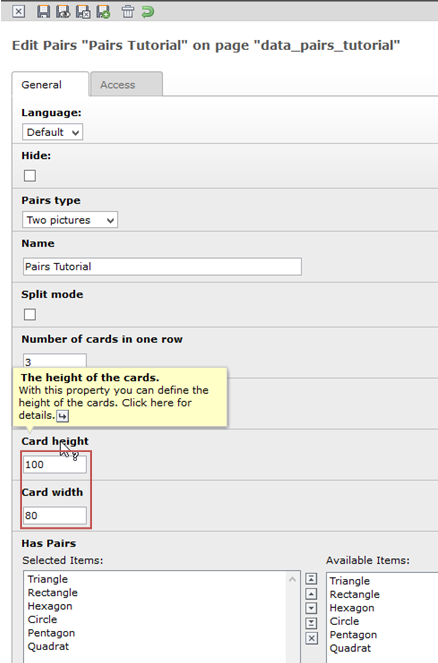
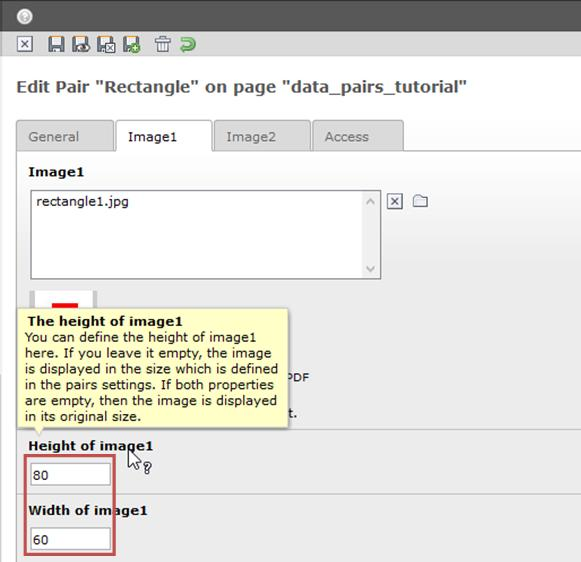
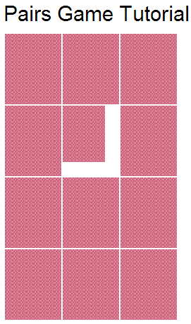
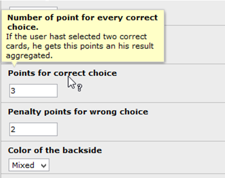
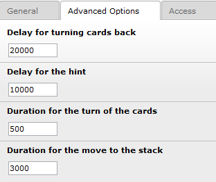

.. ==================================================
.. FOR YOUR INFORMATION
.. --------------------------------------------------
.. -*- coding: utf-8 -*- with BOM.

.. include:: ../../Includes.txt

.. _tutorial-additional-setup:

Additional setup
----------------

The card of the game seams quite large on our homepage. The reason is, that we don't have setup a
width and a height of the cards. In this case the extension takes the original size of the images.
If we like to change this we have two possibilities. The first one is to setup the size in the Pairs
for all cards at once.

The second one is to change the size in every pair individually. If we leave the size in the Pair
empty it takes always the size which will be setup in the Pairs. If both properties are empty, then
it takes the original size of the image. If we are in the pairs type “Text only” then it takes a
standard size (width: 80px and height: 100px).

With this setup you get one card with an different size, if you need it.

You are also able to set the number of points for a correct selection or the number of penalty
points for a wrong selection.

You are able to change the color of the backside of the card from red to blue or you can them
display in a mixed mode. Please refer to the more detailed context sensitive help on the label of
the fields.

On the tab advanced options you are able to adjust the speed of the animations in the frontend.
Again read here the detailed context sensitive help.

Please be carefully with this setting. In some browser you can get some weird animations if you set
here to optimistic parameters. Especially test the internet explorer after you have changed
something in these sections. 

