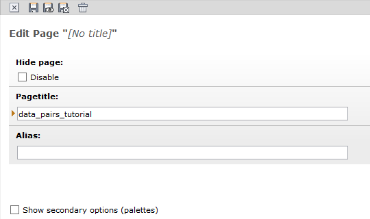
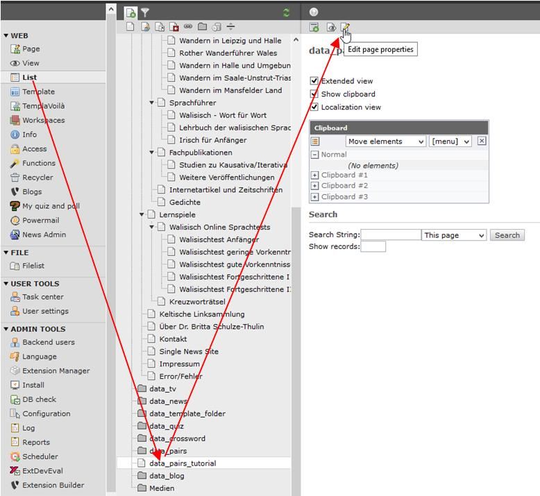
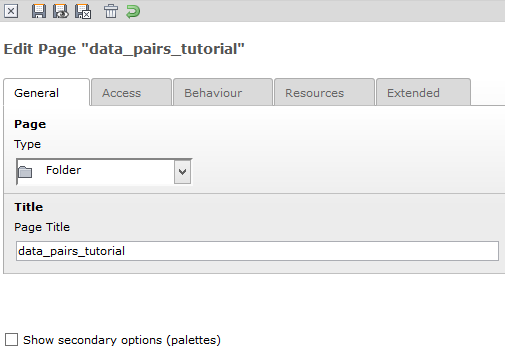
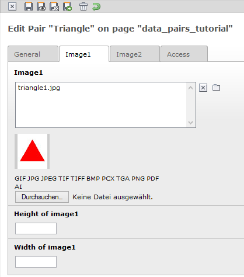
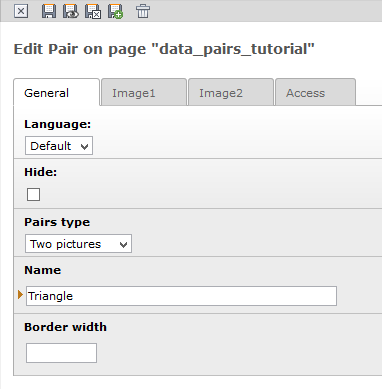

.. ==================================================
.. FOR YOUR INFORMATION
.. --------------------------------------------------
.. -*- coding: utf-8 -*- with BOM.

.. include:: ../../Includes.txt

.. _tutorial-create-the-pair:

Create the pair
---------------

We need to know that there is a big difference between a Pair and a Pairs. A Pair is a couple of
cards where we assign the image and a description of the cards. A Pairs is the pairs game itself,
where we need to assign all the Pair with the cards. So please watch the little “s” at the end.

Before we like to create our first Pair we need to create a page which should store the data for our
pairs game. For this reason we create a page at the and of our homepage (this page will never seen
on the frontend) and name it *data_pairs_tutorial*.

After this we go in the list view on the left side and select the new page. At the top of our new
page we click at button “Edit page properties”

In this view we choose the type folder and save the page.

Now we go again in the list view on the left side and then on our new folder data_pairs_tutorial.

We click now on the button “create new record” at the top of the page.

.. image:: ../../Images/image-38.jpg

In the next view you have to choose a Pair (don't choose a Pairs!). In the next view you need to set
the pairs type to “Two Pictures” and give it a meaningful name. We like to give for our example
the name triangle. On the tab Image1 we assign the image triangel1.jpg and on the tab Image2 the
picture triangle2.jpg. Both pictures can you copy from the folder typo3conf/ext/glpairs/doc/Images/
in any image folder of your homepage.

|image-20| |image-19|

After pressing the button at the top of the page you can save the pair an create a new one at the
same time. Now you need to create with the other images 5 other Pair.

