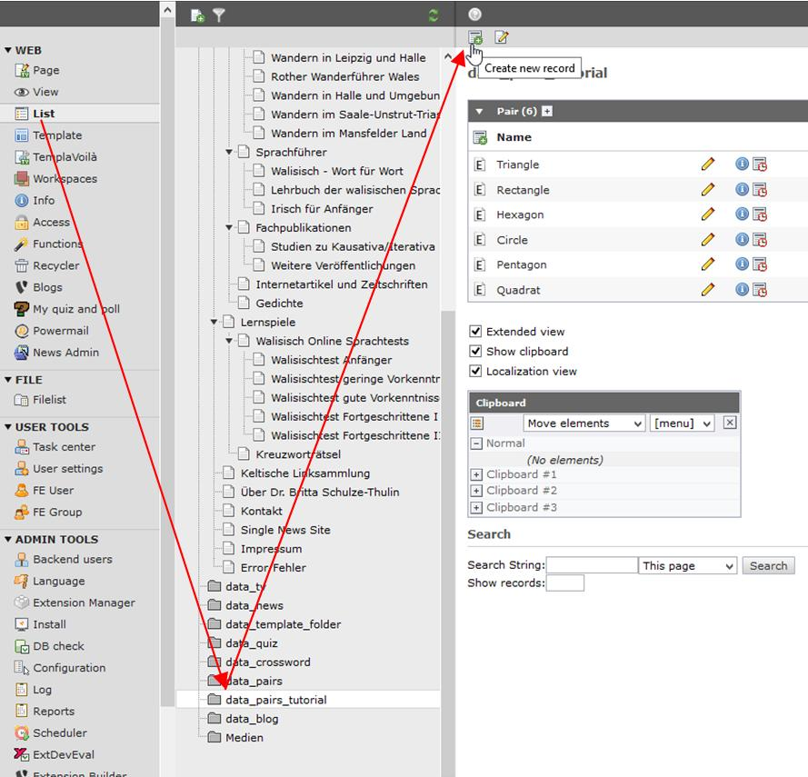
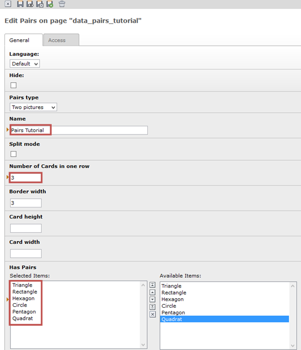

.. ==================================================
.. FOR YOUR INFORMATION
.. --------------------------------------------------
.. -*- coding: utf-8 -*- with BOM.

.. include:: ../../Includes.txt

.. _tutorial-create-the-pairs:

Create the pairs
----------------

After that you need to go again in the list view on the left side and then on our page
data_pairs_tutorial. In this view you need to press again the button “create new record” at the
top of the page.

Now you have to choose ”Pairs” (don't choose “Pair”!) and create a pairs game.

In the next view you have to choose again the pairs type to “Two pictures” and give the pairs
game a meaningful name. Set the “Number of cards in one row” to 3.

In the box an the bottom you can now select all pairs you have create before and save the pairs.

Be aware that you can only see in the selection box that Pair that have the same pairs type. I.e. if
you have setup the pairs game to “Same picture” than you cannot see the before created Pair,
because they are all from pairs type “Two pictures”.

Now our settings of the pairs game should be like this. 

