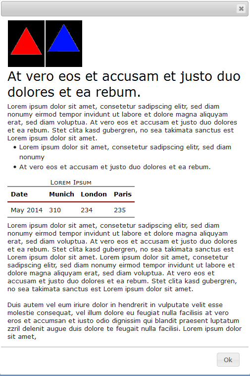
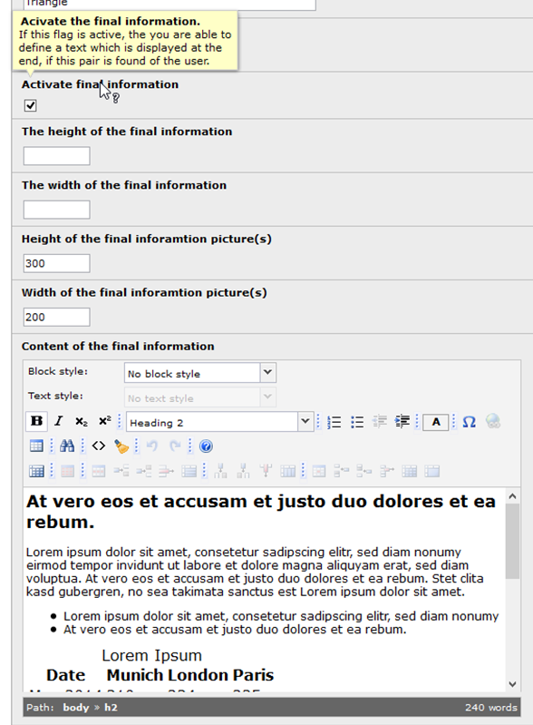
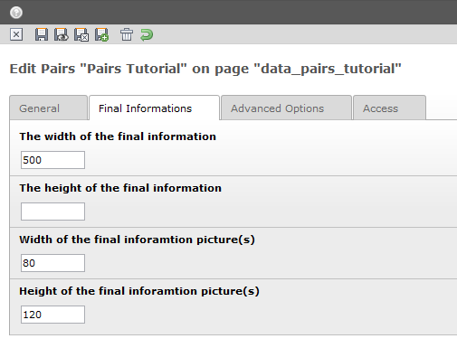

.. ==================================================
.. FOR YOUR INFORMATION
.. --------------------------------------------------
.. -*- coding: utf-8 -*- with BOM.

.. include:: ../../Includes.txt

.. _tutorial-final-information-after-every:

Final information after every pair
----------------------------------

**For this feature you need the** 
`bootstrap modal component. <https://getbootstrap.com/docs/5.1/components/modal/>`_
**Make shure you have included the bootstrap library of this extension (which is the default) or you 
have included your own bootstrap library.** 
:ref:`See configuration for bootstrap library<bootstrap_lib_config>`

You are able to display a final information, if the user has select a correct pair. This could be
useful if you have a pairs game with pictures of your hometown. If the user has select a correct
pair you can display now some additional informations about the memorial he can see on the cards.

Here an example for such an information window.

If you like to do so, you need to activate the final information in the setup of every pair like in
this figure.

After the activation you can get displayed some another options. In one you can define the content
of the final information in a rich text editor.

In two other options you can define the size of the final information window individual for every
pair. If you leave this options empty you can define the size in the pairs game overall for all
pairs in the a extra tab for final informations . With the next two options you can define the size
of the picture(s) in the final information window. So you can achieve that the pictures in the final
information window are bigger or smaller than in the pairs cards. This both options you can also
define in the options screen of the pairs game for all cards together in the extra tab for final
informations.

If you leave all the options for the size empty the window will be displayed with default
parameters. Finally it is the best you define only the width of the window and let the height empty.
In this case the size of the window will be adjusted to the inside text properly.

In the end you can check the final information in the “test mode” on the “Advanced Options”
tab. In this mode you can click on every card an get the text of the final information immediately
displayed.
