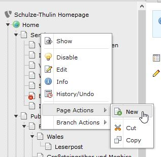
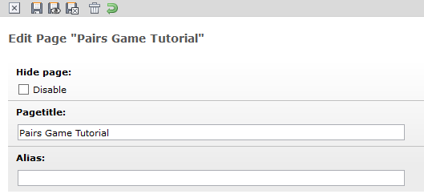
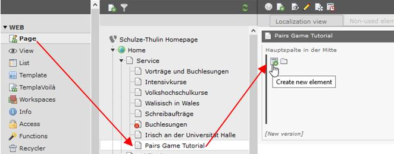
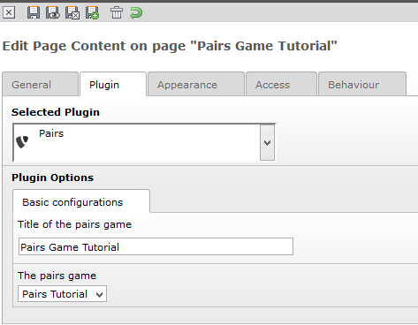

.. ==================================================
.. FOR YOUR INFORMATION
.. --------------------------------------------------
.. -*- coding: utf-8 -*- with BOM.

.. include:: ../../Includes.txt

.. _tutorial-set-the-pairs-on-your-homepage:

Set the pairs on your homepage
------------------------------

After you have create successfully the pairs game we can set it in on our homepage. If you don't
have already a page you need to create a new one with a right click on one of your pages. In the
context menu you need to choose “Page Actions” -> New.

Choose the position in the page tree and on the next view select a proper template for your page.
Then you can give the page a meaningful name and save it.

Now go in the Page view on the left side and on your new created page. Here you need to create a new
element inside your page.

|image-25|

Now we have to select a Pairs element. In the next view we need to go an the Plugin tab.
There we need to give a meaningful name again and select in the selection box on the bottom our new
created pairs game. Now we can save our pairs and we are ready.

