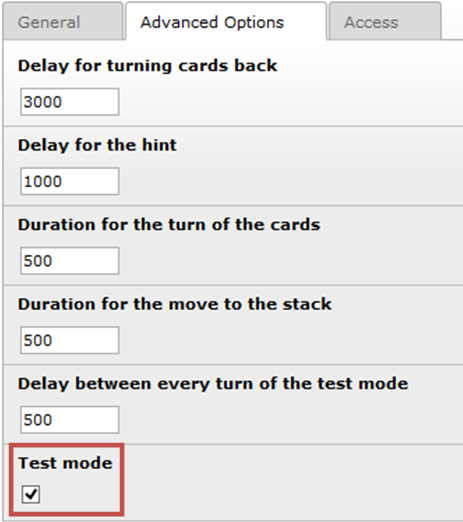
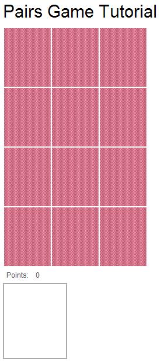

.. ==================================================
.. FOR YOUR INFORMATION
.. --------------------------------------------------
.. -*- coding: utf-8 -*- with BOM.

.. include:: ../../Includes.txt

.. _tutorial-test-the-game:

Test the game
-------------

In the beginning you should activate the “Test mode” flag in the “Advanced Options” Tab of
the Pairs record in your data folder.

|image-24|

In this mode all cards are shown on the front side directly after you have start the game
in the browser. There is no randomized order. All cards that belongs together are shown side by side
or in split mode one card in the upper right corner of the upper area and the other card in the
upper right corner in the lower area and so on. Now you can check if you have setup the right cards
to a pair and if the font size is set properly for every text card.

If everything is right you need to deactivate the “Test mode” Flag again.

Now you can go with your browser to our homepage and look at your new created pairs game and play
with it.

