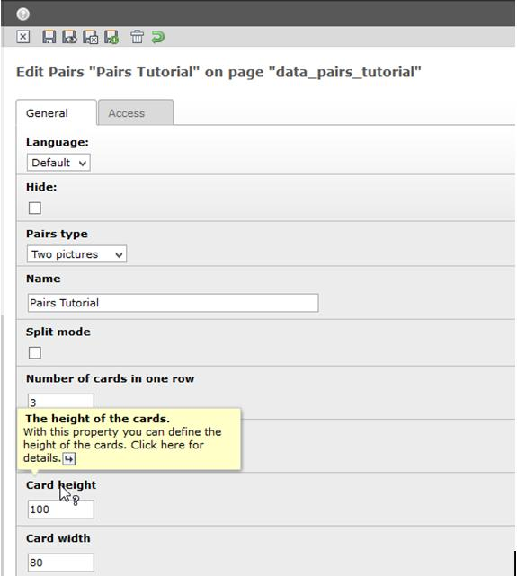

.. ==================================================
.. FOR YOUR INFORMATION
.. --------------------------------------------------
.. -*- coding: utf-8 -*- with BOM.

.. include:: ../Includes.txt

.. _users-manual:

Users manual
============

If you don't plan to create a text only pairs, then you should first find some proper pictures and
load them up to your server.

After that you need to create a folder where you store all your Pair and Pairs in Typo3. A Pair is a
pair of cards where you define the images and a description. A Pairs is the pairs game where you
assign all Pair (I mean the plural of Pair but with the “s” at the end it becomes a different
meaning). The Pair you need to create first than a Pairs. In the end you need to create a Plugin
element on your homepage and assign the created Pairs to it. Remember, all fields for the setup of
the Pair and Pairs have a context sensitive help if you go over the label of the field with your
mouse.

But before it is a good idea to read first the chapter :ref:`Administration<administration>` how to
install this extension, :ref:`Configuration<configuration>` for the settings with the javascript
libraries and finally the :ref:`Tutorial<tutorial>` for a detailed description, how to create your
first pairs game.

